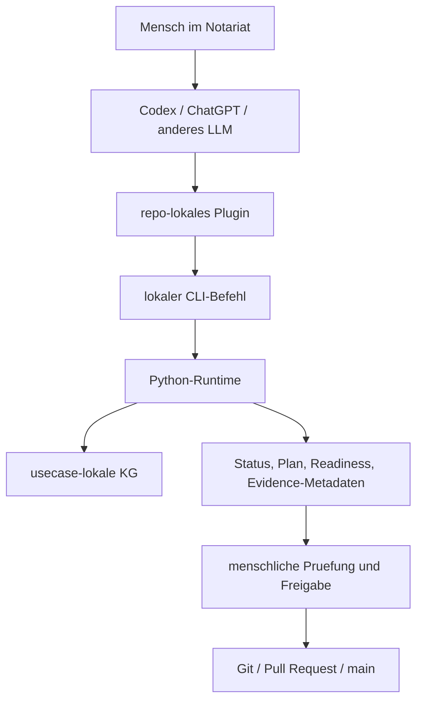

# Ausfuehrungsmodell: Warum NoC CLI-First Ist

NoC ist heute bewusst CLI-first. Das heisst: Die stabile Ausfuehrung liegt in
lokalen, pruefbaren Befehlen. Codex-Plugins, spaetere Apps oder eine UI duerfen
diese Befehle bedienen, aber sie sind nicht die fachliche Wahrheit.

## Was Bedeutet CLI?

CLI steht fuer "Command Line Interface", also Kommandozeilen-Schnittstelle. Fuer
Nicht-Techniker ist das am einfachsten so zu verstehen:

Eine CLI ist ein eindeutig benannter Arbeitsauftrag an den Computer. Statt auf
einen Button zu klicken, wird ein Befehl ausgefuehrt, zum Beispiel:

```bash
python scripts/notary_kg.py --repo-root . status
```

Der Vorteil ist nicht, dass Menschen gerne Befehle tippen sollen. Der Vorteil
ist, dass derselbe Auftrag von vielen Oberflaechen aus sauber, wiederholbar und
protokollierbar gestartet werden kann.

## Heutiges Produktbild



## Warum Das Elegant Ist

| Grund | Bedeutung |
| --- | --- |
| Wiederholbar | Derselbe Befehl liefert denselben pruefbaren Ablauf, lokal und in CI. |
| Einfach einzufuehren | Python und Git laufen auf vielen Umgebungen, ohne sofort eine zentrale Web-App zu betreiben. |
| Gut fuer sensible Daten | Befehle koennen lokal am Arbeitsplatz laufen; echte Mandatsdaten muessen nicht in eine externe UI. |
| Automatisierbar | GitHub Actions, Codex-Plugins, lokale Skripte oder spaetere Apps koennen dieselbe Runtime aufrufen. |
| UI-unabhaengig | Eine spaetere Web-UI oder ChatGPT-App ist eine Bedienoberflaeche, nicht der Kern der Logik. |
| Zukunftsfaehig | Neue Oberflaechen koennen ergaenzt werden, ohne die fachliche Runtime neu zu erfinden. |
| Auditierbar | Befehl, Eingabe, Ergebnis, Review und Merge lassen sich versioniert nachvollziehen. |

## Warum Nicht Zuerst Eine UI?

Eine UI wirkt fuer Anwender zunaechst einfacher, aber sie kann zu frueh die
falschen Dinge festlegen: Masken, Klickwege, Rollen und Datenfluesse. NoC will
zuerst den pruefbaren Kern stabil machen:

1. Welche Vorgangstypen gibt es?
2. Welche offenen Angaben, Dokumente, Entscheidungen und Gates sind noetig?
3. Welche Daten duerfen nicht in Git?
4. Welche lokalen Checks und Plugin-Gates sind sicher?
5. Welche menschliche Freigabe ist erforderlich?

Wenn diese Logik stabil ist, kann eine UI dieselbe CLI/Runtimeschicht bedienen.
So entsteht eine UI auf einem geprueften Fundament statt eine Oberflaeche ohne
belastbare Prozesslogik.

## Heute, Pilot, Spaeter

| Ebene | Stand | Rolle |
| --- | --- | --- |
| CLI und Python-Runtime | Heute nutzbar | Prueft KG, Status, Editor-View und Quality Gates. |
| Codex-Plugins | Pilotfaehig | Fuehren lokale Readiness-, Plan- und Evidence-Pruefungen gefuehrt aus. |
| GitHub Actions | Heute nutzbar | Fuehren Gates und Validierungen reproduzierbar aus. |
| Sidecar-Editor | Geplant | Grafische Bedienung fuer KG-Formulare und Checklisten. |
| ChatGPT-App oder Workspace-App | Geplant | Komfortable Bedienoberflaeche fuer berechtigte Nutzer. |
| Eigenstaendige NoC-Web-App | Nicht heutiger Kern | Moeglich, aber erst sinnvoll, wenn Runtime, Rollen und Gates stabil sind. |

## Merksatz

CLI-first bedeutet nicht "nur fuer Techniker". Es bedeutet: Der Kern ist klein,
lokal, pruefbar, automatisierbar und spaeter von vielen Oberflaechen aus
bedienbar.

## Naechste Dokumente

- [docs/de/notar-start.md](notar-start.md)
- [docs/de/betriebsstart.md](betriebsstart.md)
- [docs/de/integration-start.md](integration-start.md)
- [docs/de/kg-editor-workstream.md](kg-editor-workstream.md)
- [workflows/python/README.md](../../workflows/python/README.md)
