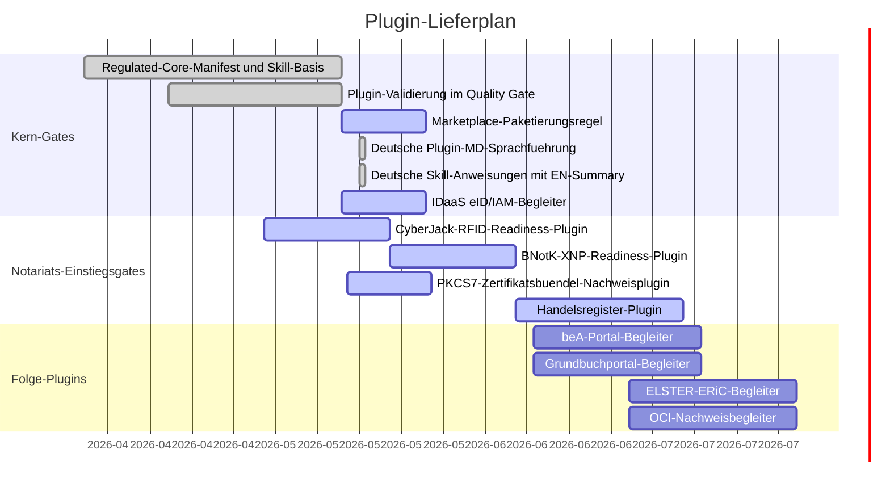

# Plugin Gantt

Letzte Aktualisierung: 2026-05-17

## Status

| Plugin | Zweck | Status | Naechstes Gate |
| --- | --- | --- | --- |
| `noc-regulated-core` | Gemeinsame Schutzplanken fuer regulierte Workflows | Basis bereit | GPT-Store-/Workspace-Paketierungsannahmen erneut pruefen. |
| `noc-idaas` | Deutsche eID-Pruefung und IAM-Projektions-Readiness | Aktiv | Connector-Grenze und Datenverarbeitungsgrundlage vor jedem Produktionspiloten bestaetigen. |
| `noc-cyberjack-rfid` | Lokale Karten-, RFID-aus-, SAK- und XNP-Local-Interface-Readiness | Aktiv | Windows DriverPackage, morris-Middleware, optionale morris-Loopback-API/PCSC-Pruefung und Linux-Treiber-Preflight sind implementiert; das lokale Gate braucht weiterhin einen angeschlossenen cyberJack-Leser oder eine manuelle Bestaetigung. |
| `noc-bnotk-xnp` | XNP-Authentifizierungs-Readiness | Aktiv | Der lokale Reader-Prompt-Nachweis bindet XNP-Preflight an das CyberJack-Gate und kann die optionale morris-API-Pruefung durchreichen; naechstes Gate ist Workstation-Validierung mit installiertem XNP. |
| `noc-pkcs7-certbundle` | Lokaler PKCS#7/P7B-Zertifikatsbuendel-Nachweis ohne Signatur | Aktiv | Installierbares MVP mit metadatenbasierter lokaler Pruefung, ohne PFX/PKCS#12-Import, ohne Private-Key-Zugriff und ohne Signaturvorgang; CI-Haertung entfernt PEM-aehnliche Testliterale aus Quellfixtures. |
| `noc-handelsregister` | Registeranmeldungs-Readiness | Aktiv | An GmbH-Gruendungs-Usecase binden. |
| `noc-bea-portal` | beA-Workflow-Begleiter | Geplant | Prioritaet fuer Notariats-/Kanzleibetrieb bestaetigen. |
| `noc-elster-eric` | ELSTER-/ERiC-Begleiter | Geplant | Von notariellem Kern getrennt halten, solange nicht benoetigt. |
| `noc-grundbuch-portal` | Grundbuch-Begleiter | Geplant | An Immobilienkaufvertrags-Starter binden. |
| `noc-oci-evidence` | OCI-Nachweisbetrieb | Geplant | Als Infrastruktur-/Nachweisplugin fuehren, nicht als Usecase. |

Plugin-Skills werden fachlich deutsch gefuehrt und enthalten eine kurze
englische Summary; technische Namen, Ordner, Commands, IDs und stabile
Output-Labels bleiben englisch/ASCII.

## Paketierungshinweis

OpenAI-GPT-Store-Veroeffentlichung und Workspace-App-Installation sind
verschiedene Kanaele. Oeffentliche GPT-Store-Pakete muessen vor Release gegen
die aktuellen OpenAI-Veroeffentlichungsregeln geprueft werden; workspace-interne
Apps und interne Notariatspiloten bleiben ein separater Track.
