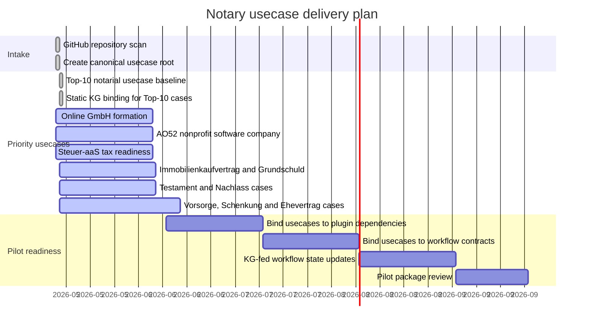

# Usecase Gantt

Last update: 2026-05-15

## Status

| Usecase | Folder | Status | Source |
| --- | --- | --- | --- |
| Top-10 notarial usecase baseline | `usecases/*/` plus `knowledge-graph/notarial-top10.graph.json` | Done | Created canonical usecase folders and KG nodes for the ten most important notarial case types. |
| Online GmbH-/UG-Gruendung | `usecases/online-gmbh-gruendung/` | Active | Canonicalized from the empty GitHub repo `ofunk/Online-GmbH-Gruendung`; now part of the Top-10 KG. |
| AO52 nonprofit software company | `usecases/ao52aas-gemeinnuetzigkeit/` | Active | Migrated from `ofunk/AO52aaS`. |
| Steuer-aaS tax readiness | `usecases/steuer-aas/` | Active | Canonicalized from the empty GitHub repo `ofunk/Steuer-aaS`. |
| Immobilienkaufvertrag | `usecases/immobilienkaufvertrag/` | KG baseline | New canonical Top-10 usecase in this repository. |
| Grundschuld / Hypothekenbestellung | `usecases/grundschuld-hypothekenbestellung/` | KG baseline | New canonical Top-10 usecase in this repository. |
| Handelsregisteranmeldung | `usecases/handelsregisteranmeldung/` | KG baseline | New canonical Top-10 usecase in this repository. |
| Beglaubigung von Unterschriften | `usecases/unterschriftsbeglaubigung/` | KG baseline | New canonical Top-10 usecase in this repository. |
| Testament / Erbvertrag | `usecases/testament-erbvertrag/` | KG baseline | New canonical Top-10 usecase in this repository. |
| Erbscheinsantrag / Nachlass | `usecases/erbscheinsantrag-nachlass/` | KG baseline | New canonical Top-10 usecase in this repository. |
| Vorsorgevollmacht und Patientenverfuegung | `usecases/vorsorgevollmacht-patientenverfuegung/` | KG baseline | New canonical Top-10 usecase in this repository. |
| Schenkungsvertrag / Uebertragungsvertrag | `usecases/schenkungsvertrag-uebertragungsvertrag/` | KG baseline | New canonical Top-10 usecase in this repository. |
| Ehevertrag / Scheidungsfolgenvereinbarung | `usecases/ehevertrag-scheidungsfolgenvereinbarung/` | KG baseline | New canonical Top-10 usecase in this repository. |

## Plugin-Classified Sources

| Source | Decision |
| --- | --- |
| `ofunk/IDaaS` | Migrated as `plugins/noc-idaas/`, not as a usecase. |

## KG Rule

The Top-10 KG is now a required strict quality-gate artifact. Every KG update
must keep all case `value` fields empty in Git and must update this Gantt plus
the global Gantt when pushed.
