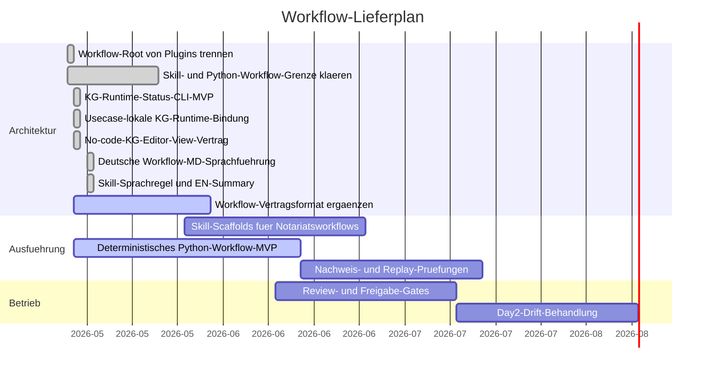

# Workflow Gantt

Letzte Aktualisierung: 2026-05-17

## Status

| Schicht | Root | Status | Grenze |
| --- | --- | --- | --- |
| Installierbare Skills | `workflows/skills/` | Geplant / Sprachregel bereit | Deutsche fachliche Anweisung fuehrt; englische Summary dient technischer Anschlussfaehigkeit, keine finale rechtliche Wahrheit. |
| Python-Workflows | `workflows/python/` plus `src/notary_kg/` | Aktiv | Die deterministische KG-Status-Runtime liest usecase-lokale KG-Dateien und stellt die sichere No-code-Editor-View bereit. |
| Workflow-Vertraege | `workflows/contracts/` | Aktiv | Eingaben, Ausgaben, Freigaben, Datenklassen, Plugin-Abhaengigkeiten und der implementierte KG-Editor-Vertrag. |
